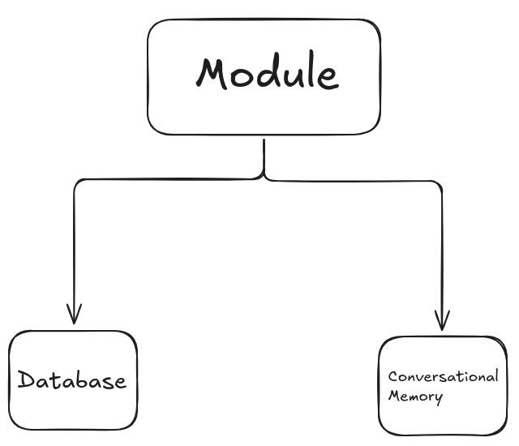
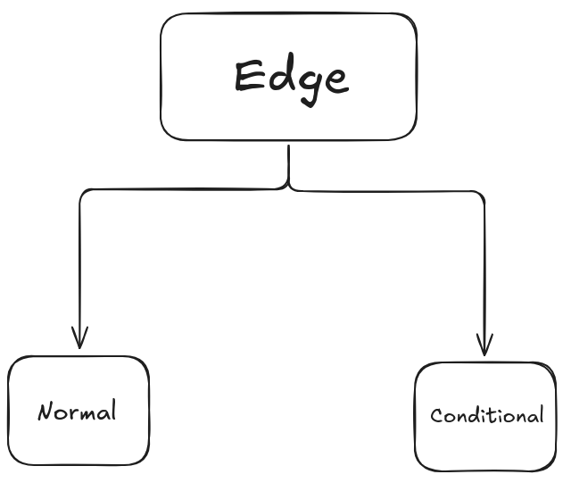
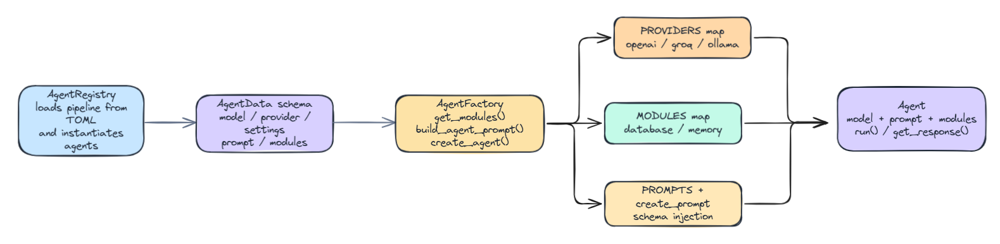

# Project Documentation

This folder contains the main documentation for the codebase, including architecture overviews.

## Visual Overview

### Architecture

Modules provide reusable capabilities to AI agents.

Each module gives an agent access to a specific capability.

Example:
The database module allows an agent to generate and execute SQL queries.



---

### Request Flow

Edges define the transitions between nodes in the workflow.

A normal edge directly connects one node to another:

```toml
[[edge]]
source = "generator"
dest = "explainer"
````

A conditional edge uses a router function to determine which node should be executed next based on the current state:

```toml
[[edge]]
source = "generator"
type = "conditional"
router = "redirection"

[edge.routes]
explainer = "explainer"
exception = "exception"
```

The router returns a route key, which is mapped to the corresponding destination node.



---

### Creation Chain

The creation chain describes how the application builds the workflow:



---

## What the Project Covers

* `app/main.py` initializes FastAPI, loads the workflow configuration, and compiles the LangGraph workflow.
* `app/api/routes.py` exposes API endpoints such as `/`, `/health`, and `/chat`.
* `app/agents/` contains agent definitions, the registry, factories, and model providers.
* `app/modules/` contains reusable agent capabilities such as database access and memory management.
* `app/workflows/` defines workflow construction, edges, and routing logic.
* `app/schemas/` contains shared state and context models.
* `app/tasks/` handles background tasks such as memory cleanup and agent lifecycle management.
* `app/prompts/` contains prompt templates and business-related schemas.

## Environment Variables

* `CONFIGURATION` specifies the path to the workflow configuration file.
* `DB_USERNAME`, `DB_PASSWORD`, `DB_HOST`, `DB_PORT`, and `DATABASE` configure the MySQL connection.
* `OPENAI_API_KEY` and `GROQ_API_KEY` are used by their respective LLM providers.
* `MEMORY_TIMEOUT_SECONDS` defines the inactivity duration before memory cleanup.